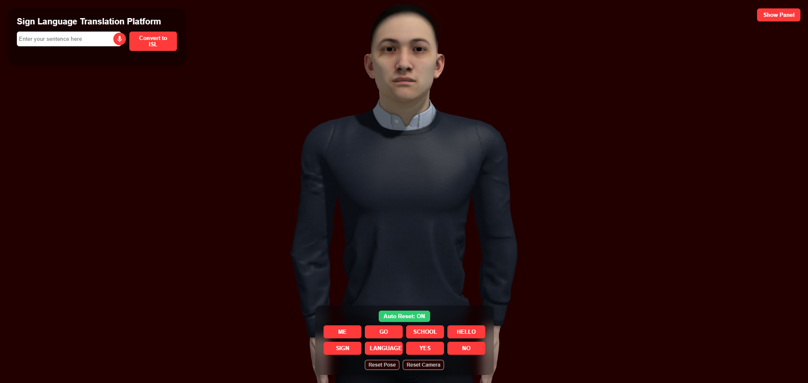
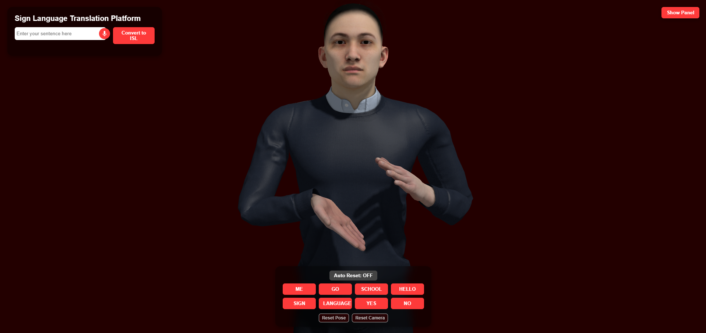
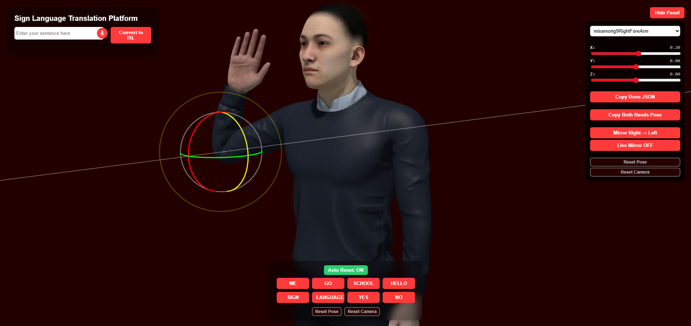

# 🤟 Indian Sign Language (ISL) Translation Platform


---

# 📌 Project Overview

The **Indian Sign Language (ISL) Translation Platform** is an **assistive web-based system** that converts **English text or speech into Indian Sign Language** using a **3D animated avatar**.

This platform aims to **bridge the communication gap between hearing individuals and people who are deaf or speech-impaired** by translating spoken or written language into **visual sign language gestures**.

The system combines **Natural Language Processing (NLP)** with **real-time 3D animation** to generate **accurate and expressive sign gestures performed by a digital avatar**.

This project demonstrates the integration of **AI-driven language processing and interactive graphics** to create accessible communication tools.

---

# 🖼️ Application Screenshots

### 🧑‍💻 Main User Interface


### 🎭 3D Avatar Performing Sign Gestures


### ⚙️ Bone Control Editor (Gesture Creation Tool)


---

# 🎯 Project Objectives

- Convert **English text into Indian Sign Language**
- Support **speech-to-text translation**
- Generate **real-time 3D sign language animations**
- Improve accessibility for **deaf and speech-impaired individuals**
- Provide a **visual learning and demonstration tool for sign language**

---

# 🚀 Key Features

## 🔤 Text & Speech Translation
- English text → ISL translation
- Speech-to-text input support
- NLP-based ISL grammar restructuring

---

## 🎭 3D Avatar Animation
- Real-time animated avatar
- Smooth gesture transitions
- Sequential playback of sign gestures
- Word highlighting during animation

---

## 🛠️ Gesture Editing System

The platform includes a **gesture creation and editing interface** for developing new signs.

Features include:

- Bone control panel
- Real-time bone rotation sliders
- Pose export to JSON format
- Gesture mirroring (right ↔ left)
- Custom gesture creation system

---

## 🎛️ Interactive Interface Controls

- Auto-reset toggle
- Camera reset
- Pose reset
- Gesture testing buttons
- Real-time avatar manipulation

---

# 🧰 Technology Stack

## 🔹 Frontend
- HTML5
- CSS3
- JavaScript
- **Three.js** (3D rendering engine)

---

## 🔹 Backend
- Python
- Flask

---

## 🔹 Natural Language Processing
- **NLTK**

Used for:
- Tokenization
- Sentence processing
- ISL grammar conversion

---

## 🔹 3D Animation System

- FBX Character Model
- Mixamo Rigging
- Bone-based animation control
- JSON-based gesture storage

---

# 🧠 System Workflow

1️⃣ User enters **text or voice input**  
2️⃣ Input is sent to the **Flask backend server**  
3️⃣ NLP processes the sentence and converts it into **ISL grammar order**  
4️⃣ Processed words are returned to the frontend  
5️⃣ The **3D avatar performs gestures sequentially**  
6️⃣ Each word is highlighted while its gesture is played  

---

# 📂 Project Structure

```

ISL-Project
│
├── app.py
│
├── utils
│   └── isl_processor.py
│
├── static
│   ├── css
│   │   └── style.css
│   │
│   ├── js
│   │   └── index.js
│   │
│   ├── models
│   │   └── character.fbx
│   │
│   ├── images
│   │
│   └── isl_data.json
│
├── templates
│   └── index.html
│
└── README.md

````

---

# ⚙️ Installation

### 1️⃣ Clone the Repository

```bash
git clone https://github.com/yourusername/isl-project.git
cd isl-project
````

---

### 2️⃣ Create Virtual Environment

```bash
python -m venv venv
```

Activate environment

Windows

```
venv\Scripts\activate
```

Mac / Linux

```
source venv/bin/activate
```

---

### 3️⃣ Install Dependencies

```
pip install flask nltk
```

---

### 4️⃣ Run the Application

```
python app.py
```

Open browser:

```
http://127.0.0.1:5000
```

---

# 🔍 Use Cases

* Communication assistance for **deaf and speech-impaired individuals**
* Educational tool for **learning Indian Sign Language**
* Demonstration platform for **NLP and 3D animation integration**
* Accessibility research and assistive technology development

---

# 🔮 Future Improvements

* Larger ISL vocabulary dataset
* AI-based gesture generation
* Continuous sentence animation
* Mobile device optimization
* Webcam gesture recognition
* Integration with video conferencing platforms

---

# 🎓 Academic Context

This project was developed as a **Final Year Project (FYP)** focusing on:

* Natural Language Processing
* Assistive Technology
* 3D Animation Systems
* Human Computer Interaction
* Accessibility Engineering

---

# 👨‍💻 Author

**M. Giftson Raj**

Full Stack Developer

GitHub
[https://github.com/MGiftsonRaj40](https://github.com/MGiftsonRaj40)

Portfolio Website
[https://hello-giftson.web.app/](https://hello-giftson.web.app/)

---

⭐ If you found this project interesting, consider **starring the repository**!
